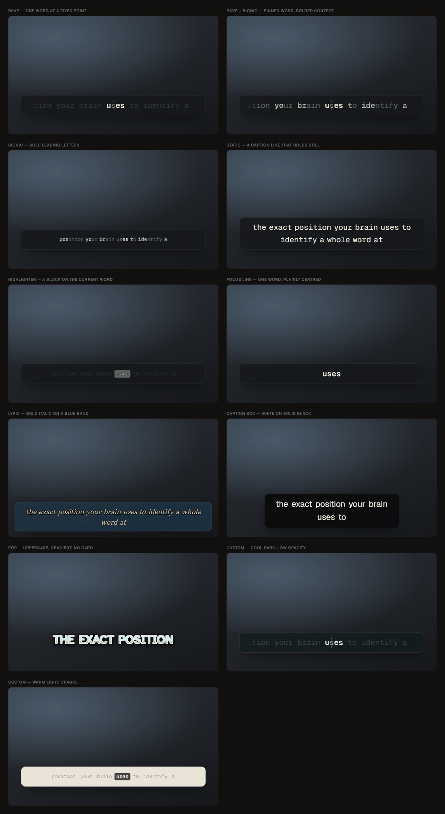
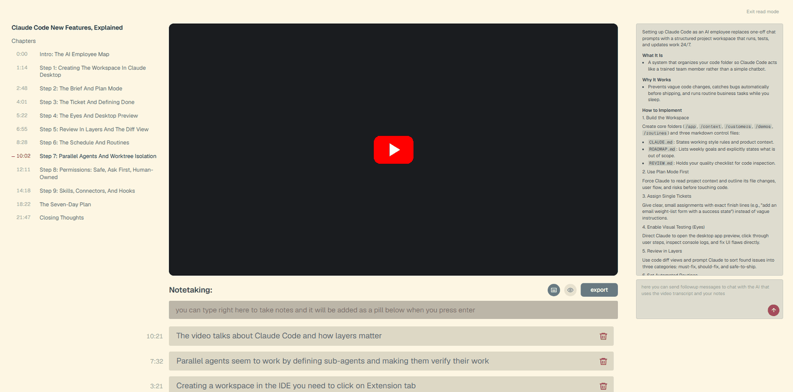

<p align="center">
  
</p>

<h1 align="center">TextReadsFast for YouTube</h1>

<p align="center">
  <strong>Read YouTube subtitles one word at a time — so 2x actually works.</strong>
</p>

<p align="center">
  <a href="LICENSE"></a>
  
  
</p>

A browser extension that replaces YouTube's captions with a single word held at
a fixed focal point. Your eyes stop moving, so the words can move faster than
you could read them line by line.

The speed comes from YouTube's own playback rate. Set it to 2x or 3x and the
reader tracks it exactly, because it reads from the video clock rather than a
timer of its own.

> **Status: early.** Built and unit-tested, but not yet run against a broad
> range of real videos. See [Known risks](#known-risks).

---

## The science

### Reading is slow because the eye moves

Skilled silent reading runs at roughly **200-300 words per minute**, and that
ceiling is not set by how fast the brain recognises words. It is set by the
mechanics of looking.

Your eyes do not glide along a line. They move in jerks — **saccades** — and see
almost nothing during the jump itself, a phenomenon called _saccadic
suppression_. Vision happens only in the still moments between them, the
**fixations**, which last around **200-250 milliseconds** each. A saccade in
reading advances about 7-9 characters and takes 20-50ms, and roughly **10-15% of
them go backwards** — _regressions_, where you re-read something that did not
land the first time.

So the cost of reading a line is not the recognition. It is the fixate, jump,
re-acquire, occasionally jump back cycle, repeated for every few characters.
Only a narrow window around each fixation is sharp enough to read at all: the
**fovea** covers about 1-2° of visual angle, which is a handful of letters.
Everything else on the line is peripheral blur that your brain is quietly
guessing at.

This is the best-established finding in reading research — Keith Rayner's
reviews of eye movements in reading are the standard reference — and it is the
one thing an interface can actually do something about.

### RSVP removes the movement

**Rapid Serial Visual Presentation** presents words one at a time at a single
screen position. The text moves; the eye does not. No saccades, no
re-acquisition, no line-ends to find, no place to lose.

Mary Potter's work in the 1970s-80s established the striking part: people can
extract the **gist** of a stream at rates far above normal reading — on the
order of **10+ words per second** — because word recognition itself was never
the bottleneck.

### The Optimal Recognition Point

Removing saccades is only half of it. Where a word is presented matters too.

Word recognition is fastest when the eye lands **slightly left of the word's
centre** — a finding from Kevin O'Regan and colleagues, usually called the
_Optimal Viewing Position_. Land there and the whole word falls inside the
sharp foveal window at once. Land on the first or last letter and recognition
measurably slows, because part of the word is out in the blur.

Normal reading spends effort _targeting_ that position on every word. RSVP can
simply guarantee it: shift each word so its optimal letter sits on the same
fixed column, every time. Your eye finds it once and never has to move again.

That letter is the red one. In this extension it is called the **Optimal
Recognition Point**, and holding it still is the entire mechanism:

```
        ·
    But un̲til a few
        ·
```

The two small marks are a fixation anchor — something for the eye to hold onto
so it does not drift toward the middle of longer words.

### What RSVP costs, honestly

The 1000-words-per-minute claims made for RSVP reading apps did not survive
scrutiny, and it is worth being clear about why. Three real losses:

- **No regressions.** Normal readers jump back when a sentence does not resolve,
  and that repair is a load-bearing part of comprehension. A word stream does
  not let you. When comprehension breaks, it stays broken.
- **No parafoveal preview.** While fixating one word you are already extracting
  information from the next, which saves real time per word. Showing one word
  alone throws that benefit away — which is part of why RSVP is not simply
  free speed. This is the loss the **RSVP + Bionic** mode exists to soften: a
  bolded word-opening stays legible further into the periphery than a plain
  one, so the neighbours can be taken in without moving fixation off the pivot.
- **No wrap-up time.** Readers slow down at clause and sentence boundaries to
  integrate what they have just read. A constant-rate stream gives no room for
  it, so complex or unfamiliar material suffers most.

The honest summary: **RSVP reliably beats normal reading for gist at high speed,
and reliably loses to it for careful study of difficult text.**

### Why this is a good fit for video specifically

Here is the argument for putting RSVP over YouTube rather than over a book.

Conversational speech runs at roughly **150 words per minute**. Play a video at
**2x** and you are at ~300 wpm — the top of ordinary silent reading. At **3x**
you are near 450 wpm, past what reading a subtitle line can keep up with. That
is precisely the range where removing saccades stops being a parlour trick and
starts being the only way to follow along.

And the two big RSVP costs are much smaller here than they are for prose:

- **You are not relying on the text alone.** The audio is running in parallel.
  Speech and text are processed through partly different channels, so the stream
  is reinforcing something you are already receiving rather than carrying the
  whole message by itself.
- **You can regress after all.** It is a video: scrub back a few seconds. The
  chapter list and timestamped notes in Read Mode exist partly for this — they
  are the repair mechanism RSVP normally denies you.
- **The pace is not arbitrary.** Most RSVP apps ask you to pick a words-per-
  minute number, which is a guess. Here the rate is set by the speaker, and the
  reader is a lookup against `video.currentTime` — so pausing, seeking and
  changing speed are handled by the video clock rather than estimated.

### A note on Bionic Reading

Bionic-style bolding of each word's leading letters is included because a fair
number of people find it genuinely more comfortable, and comfort matters over a
long session.

But the evidence that it makes you read _faster_ is weak — independent attempts
to replicate the claimed speed benefit have largely not found one. It is offered
as a preference, not as a performance feature, and the accent colour on the bold
letters can be turned off entirely if you want it quieter still.

The same applies to the other line modes. **Static** and **Highlighter** make no
speed claim at all. They exist because a fixed focal point is demanding, and
sometimes you want a calm subtitle you can glance at instead.

**Static** is the deliberate opposite of everything above. Every other mode
advances one word per word, so something on screen changes roughly three hundred
times a minute. Static shows a whole line, holds it still, and swaps once at a
sentence or clause boundary — around twenty times a minute. It makes no claim to
speed at all; it is there for when you want to be able to look away.

Because YouTube's own cue boundaries do not survive parsing — the transcript is
flattened into one timeline of words, which is what every sliding mode needs —
the lines are rebuilt from the punctuation, breaking at sentences, at clauses
once a line is worth ending, and at a hard cap so an unpunctuated
auto-transcript cannot run off the card. See
[`src/content/lines.ts`](src/content/lines.ts).

## Reading modes

RSVP is the point of the thing, but it is not for everyone or for every video.
Six modes, all reading the same word stream:

<p align="center">
  
</p>

| Mode              | What it does                                                                                                          |
| ----------------- | --------------------------------------------------------------------------------------------------------------------- |
| **RSVP**          | One word, pinned at the focal point, with the pivot letter picked out. The original.                                  |
| **RSVP + Bionic** | The same pinned word, with the neighbours' leading letters bolded so you can read ahead.                              |
| **Bionic**        | A line at once, leading letters emboldened. The accent on them can be turned off.                                     |
| **Static**        | An ordinary subtitle. Holds completely still and swaps a whole line at a time — the only mode in which nothing moves. |
| **Highlighter**   | A block behind the current word, the way captions look on Shorts. Holds up at speed.                                  |
| **Focus line**    | RSVP's rhythm without its coloured letter — one word, plainly centred.                                                |

Eleven palettes, including a **Custom** one with four colour pickers, plus a
slider for how much of the video shows through the card behind the words — down
to none at all, for text that sits directly on the picture.

The typography composes on top of any of them: **slant**, **letter case**,
**weight**, and an **outline** around every glyph. The outline is the one that
matters most — a dark edge is what makes text legible over an arbitrary moving
picture, and it is why a caption with no card behind it can work at all.

> Two honest limits. No italic faces are bundled, so the slant is the browser
> slanting the upright one — fine on the serifs, less so on the monospaces. And
> not every family ships every weight (Geist stops at 600), above which the
> browser thickens it itself and it reads thinner than a real bold. Both are
> because `src/reader-core/fonts.css` is byte-identical to the desktop app, so
> adding faces means changing both repositories.

## Profiles

Click the toolbar icon to switch profile mid-video, which is usually when you
want to: the right settings depend on what is on screen.

| Profile           | What it is for                                                          |
| ----------------- | ----------------------------------------------------------------------- |
| **Default**       | One word at a fixed point, dark, a little context either side.          |
| **Peripheral**    | Pinned word, bolded context. Focus and preview at once.                 |
| **Serif Flow**    | A whole line at once, serif on neutral grey. Reads like a page.         |
| **Reading Room**  | Light and warm, for daytime and bright video.                           |
| **Night Study**   | Bionic on deep blue-grey, for a lecture in the dark.                    |
| **Sprint**        | Large, narrow, almost no context. For 2x and above.                     |
| **Clarity**       | Big, high contrast, letter shapes drawn for low vision.                 |
| **Quiet Caption** | An ordinary subtitle line, dimmed either side. Nothing flashes.         |
| **Highlighter**   | A block on the word being spoken. Holds up at speed.                    |
| **Lyric**         | Gold italic serif on a translucent blue band, the width of the picture. |
| **Caption Box**   | White on solid black. The plainest, most legible thing there is.        |
| **Pop**           | Big uppercase over the picture, no card. Two or three words at a time.  |

Editing any control leaves the change live and marks the profile _modified_ —
built-ins are never overwritten, so **Default** stays exactly as shipped
whatever you do to it. **Save as…** keeps your version under its own name.

## Read Mode

A study view for the video you are already watching. Press **Shift+R**, or use
the toolbar popup.

<p align="center">
  
</p>

- **Chapters, on the left.** YouTube's own chapter list when the video has one.
  When it does not, the transcript is segmented and the sections are named by a
  model — asked for once, then saved.
- **Notes, under the video.** Start typing anywhere and the note box takes it.
  Each note keeps the timestamp it was written at; clicking one seeks there.
- **An assistant, on the right.** Summarises the transcript when you open the
  view, and answers questions about it afterwards. **Requires your own API key
  — see [Privacy and data](#privacy-and-data).**
- **Export** to a single Markdown file — summary, notes, the questions you
  asked, and optionally the whole transcript. Point it at an Obsidian vault or
  pick the folder each time.
- **A library** of past sessions, with watch time, coverage and rewatch counts.
  Tracking is a setting, and turning it off stops the recording rather than
  merely hiding it.

The reader keeps running over the video the whole time. Read Mode changes the
page around the video, not the video.

## How it differs from the desktop app

[TextReadsFast](https://github.com/Ramonvdo/textreadsfast) transcribes your
computer's audio live, which means guessing when each word was spoken and pacing
against a backlog that can never quite be trusted.

Here, YouTube hands over the entire transcript with timings attached before
playback starts. So there is no transcription, no backlog, no pacing to
estimate — the current word is a lookup against `video.currentTime`. Seeking,
pausing and playback rate all work without a line of code, because the video
clock already accounts for them.

The two share their reading engine — the pivot maths and alignment — so a word
lands identically in both. See [`src/reader-core/`](src/reader-core/README.md).

## Install

Not yet on the Chrome Web Store. To run it now:

```bash
pnpm install
pnpm run build
```

Then open `chrome://extensions`, enable **Developer mode**, choose **Load
unpacked**, and select **`dist/`** — not the repository root. The root has no
manifest precisely so it cannot be loaded by mistake; `dist/` is the extension.

Chrome and Edge; Firefox is a later port, since its MV3 differs enough to be its
own task.

`pnpm run watch` rebuilds on change — reload the extension to pick changes up.

## Settings

Click the toolbar icon → **All settings…**, or find Options on
`chrome://extensions`. There is a live preview running the real overlay, so
every control can be judged by looking at it.

Defaults match the desktop app so the two feel like one product.

## Privacy and data

**The reader itself never sends anything anywhere.** Caption tracks are read
from YouTube, which your browser is fetching regardless, and settings live in
`chrome.storage.sync`. There is no analytics, no telemetry, and no account.

**The Read Mode assistant is the one exception, and it is opt-in.** It does
nothing at all until you add your own API key. Once you have:

- Opening Read Mode sends **the video's transcript and title** to the provider
  you configured — [OpenRouter](https://openrouter.ai) by default — to generate
  the summary. Questions you type are sent with it.
- Your key is stored in `chrome.storage.local`, which is **not** synced to
  Google's servers or to your other devices, and is never given to any content
  script. Only the extension's own service worker can read it, and
  `pnpm run check-boundaries` fails the build if that stops being true.
- Network access to the provider is an **optional** permission, requested the
  first time you save a key rather than granted at install.
- Notes, sessions and stats are held in the extension's own IndexedDB, on this
  device only.

Delete the key and the extension goes back to sending nothing. Full detail in
[PRIVACY.md](PRIVACY.md).

## Known risks

**YouTube's caption plumbing is not a public API.** It changes, and this
extension reads it three ways so that one change does not break everything:

1. **Fetch the caption track directly**, from the URL in the page's player
   response. Works without the viewer turning captions on — when it works.
2. **Capture what the player fetches for itself.** A page-context script hooks
   `fetch` and `XMLHttpRequest` for `/api/timedtext`. Always correctly signed,
   but only fires once captions are switched on.
3. Failing both, the extension does nothing at all.

Route 1 is already unreliable. Requesting a caption track without the
proof-of-origin token the player attaches returns **HTTP 200 with an empty
body** — verified against a live video — rather than an error. Anything trusting
the status code would conclude it had captions and then render nothing, which is
why success here is judged on whether words actually came out.

**Word-level timing depends on the track.** Auto-generated captions carry a
per-word offset, which is exactly what this needs. Manually uploaded ones
usually give a whole phrase per cue, so those are interpolated across the cue by
character count — good enough to read along with, but not as tight.

**Videos with no captions do nothing.** That is deliberate: there is no
transcription here, so there is nothing to fall back to.

**A model can be wrong.** Summaries and generated chapter names are a model's
reading of the transcript, not a transcript of the video. Treat them as notes,
not as a record of what was said.

## Development

```bash
pnpm run typecheck
pnpm test               # reader, captions, chapters, charts, read mode
pnpm run check-drift    # reader-core vs the desktop app
pnpm run check-boundaries  # the API key cannot reach a content script
pnpm run check          # all of the above
pnpm run shoot          # screenshot both harnesses, assert their geometry
```

```
src/
  reader-core/   copied from the desktop app — do not edit here
  content/       caption parsing, the overlay, the video-clock loop
  page/          runs in the page context to reach YouTube's own objects
  readmode/      the study view: chapters, notes, assistant, export
  background/    the service worker: the API key, the provider, the library
  library/       saved sessions and study stats
  options/       settings page
  popup/         toolbar profile switcher
  dev/           screenshot harnesses, not shipped
  profiles.ts    the built-in profiles and the saved-profile store
```

Two boundaries are enforced by scripts rather than by convention:

- **The API key never leaves the service worker.** `check-boundaries` fails the
  build if anything under `src/content/` or `src/page/` references it. A content
  script runs in YouTube's page and must not be trusted with it.
- **`src/reader-core/` is byte-identical to the desktop app.** `check-drift`
  compares them and fails on any difference. It cannot prevent divergence, only
  make it visible — if the two disagree about where a pivot goes, the same word
  reads differently in the app than in the browser.

`pnpm run shoot` renders both harnesses in headless Chromium and asserts their
geometry. It is what catches layout regressions that no unit test can see —
including whether the Highlighter block changes a word's width and makes the
whole line twitch.

## Releases

Pushing a version tag builds a Chrome-Web-Store-ready zip and attaches it to a
draft release:

```bash
git tag v0.1.1 && git push origin v0.1.1
```

Publishing to the store itself is a manual, human-reviewed process — see
[PUBLISHING.md](PUBLISHING.md).

## Security

Found a vulnerability? Please report it privately — see [SECURITY.md](SECURITY.md).

## License

MIT — see [LICENSE](LICENSE). Bundled fonts are SIL Open Font License 1.1; see
[public/fonts/LICENSES.md](public/fonts/LICENSES.md).

Not affiliated with, endorsed by, or sponsored by YouTube or Google. See
[DISCLAIMER.md](DISCLAIMER.md).
